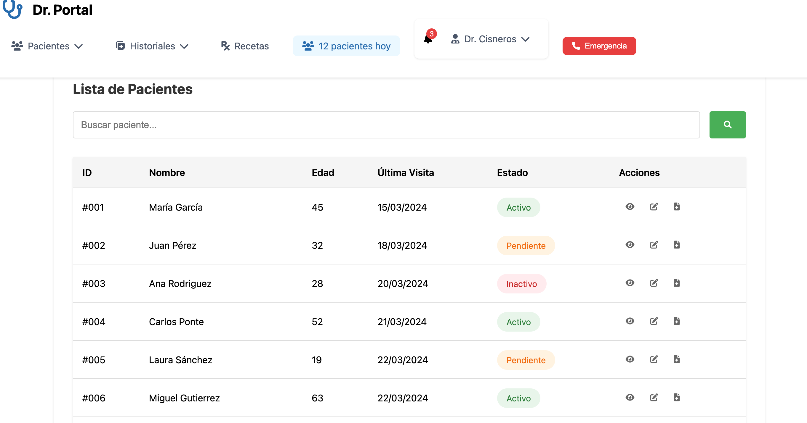
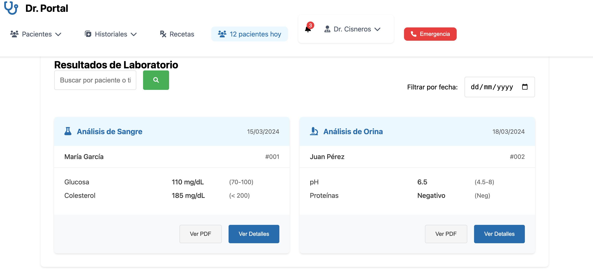
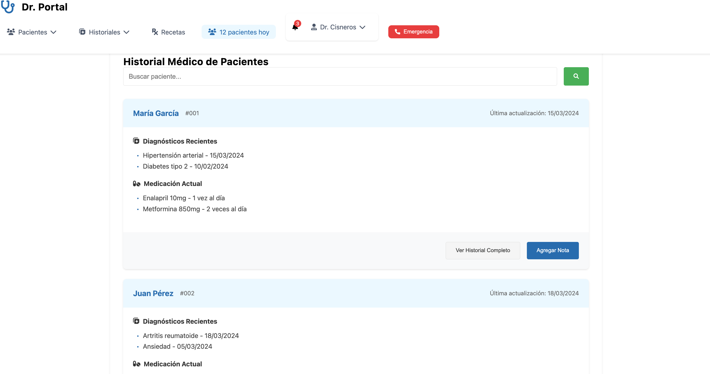
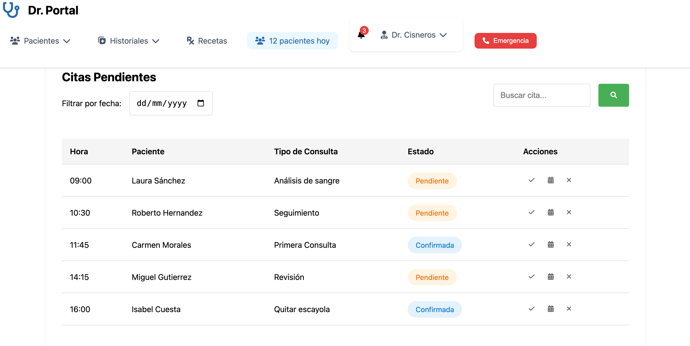
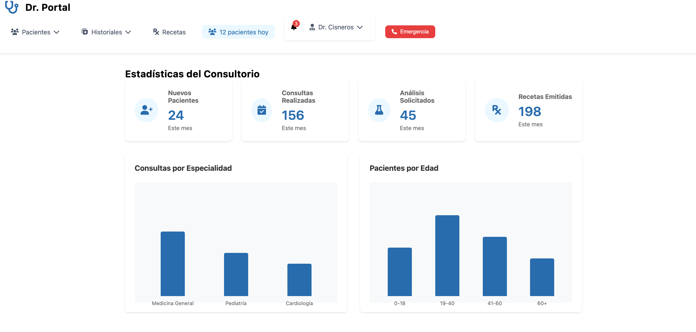

# Medical Panel - Clinical Management System (Frontend)

## 📋 Description
Medical Panel is a frontend interface for clinic management with static data demonstration.


## 📸 Snapshots

### Dashboard 

*Main dashboard view*

### Patient List

*Patient management and search*

### Laboratory Results

*Laboratory results view with PDF export option*

### Medical History

*Patient medical history visualization*

### Pending Appointments

*Pending appointments panel*

### Statistics

*Statistics panel*

## 🚀 Implemented Features

### ✅ Functionalities
1. **Patient List**
   - Real-time search by name and ID
   - Status visualization (Active, Pending, Inactive)

   - **Patient List Actions:**
     ```html
     <!--View Details Button (👁️) -->
     <button class="action-btn"><i class="fas fa-eye"></i></button>
     - Opens a modal with detailed patient information
     - Shows ID, name, age, last visit and status
     - Can be closed with X button or clicking outside

     <!-- Edit Patient Button -->
     <button class="action-btn"><i class="fas fa-edit"></i></button>
     - Opens a modal form to edit patient
     - Allows name and status modification
     - ID in read-only mode
    
     ```

2. **Emergency Button**
   - Emergency contacts modal
   - Direct call to emergency numbers
   - On-duty medical contacts list
  
   ```html
   <button class="emergency-btn">
       <i class="fas fa-phone"></i>
       Emergency
   </button>
   ```


2. **Dynamic Forms**
   - Pre-populated fields with current data
   - Required field validation
   - Save and cancel buttons

2. **Navigation**
   - Show/hide container system
   - Functional dropdown menus
   - Default dashboard

3. **PDF Export**
   - Laboratory results export to PDF
   - Automatic button removal in PDF version

### 📅 Appointment Management
- Pending appointments visualization

### 📝 Medical Records
- Diagnosis visualization
- Treatment history
- Current medication

### 🔬 Laboratory Results
- Analysis visualization
- PDF export

### 🏥 Diagnostics
- Medical conditions visualization
- Treatment details
- Patient monitoring

### 👨‍⚕️ Doctor Profile
- Personal information
- Credentials

## 🛠️ Technologies Used
- HTML5
- CSS3
- JavaScript
- External Libraries:
  - Font Awesome 6.0.0 (for icons)
  - html2pdf.js 0.10.1 (for PDF export)

## 💻 Installation and Usage
1. Clone the repository
2. Open index.html in a web browser
3. No additional configuration required

## 📱 Responsive Design
- Adaptable to multiple devices
- Optimized mobile menu
- Flexible layouts

## 🔄 Navigation
The system implements dynamic navigation that:
- Shows only one container at a time
- Automatically hides other sections
- Maintains clean and organized interface state

### Main Containers:
- Dashboard (`dashboard-container`)
- Patient List (`patients-list-container`)
- New Patients (`new-patient-container`)
- Pending Appointments (`pending-appointments-container`)
- Medical History (`medical-history-container`)
- Laboratory Results (`lab-results-container`)
- Diagnostics (`diagnostics-container`)
- Prescriptions (`prescriptions-container`)
- Statistics (`statistics-container`)
- Doctor Profile (`doctor-profile-container`)

## 🔥 Critical Points and Complexities

### 1. Container and Navigation Management
- Logic for correctly showing/hiding containers
- Prevent multiple containers from showing simultaneously
- Maintain consistent navigation state

```js
function hideAllContainers() {
Object.values(containers).forEach(container => {
if (container) {
container.style.display = 'none';
}
});
}
```

### 2. Real-Time Search System
- Dynamic patient filtering
- Handling no results cases
- Performance optimization in large tables

```js
function filterPatients(searchTerm) {
searchTerm = searchTerm.toLowerCase();
let hasResults = false;
tableRows.forEach(row => {
const name = row.querySelector('td:nth-child(2)').textContent.toLowerCase();
const id = row.querySelector('td:nth-child(1)').textContent.toLowerCase();
if (name.includes(searchTerm) || id.includes(searchTerm)) {
row.style.display = '';
hasResults = true;
} else {
row.style.display = 'none';
}
});
}
```

### 3. Form and Data Management
- Patient data validation
- Automatic ID generation
- Precise age calculations

```js
function getNextPatientId() {
const rows = document.querySelectorAll('.patients-table tbody tr');
let maxId = 0;
rows.forEach(row => {
const id = parseInt(row.querySelector('td:first-child').textContent.replace('#', ''));
maxId = Math.max(maxId, id);
});
return String(maxId + 1).padStart(3, '0');
}
```